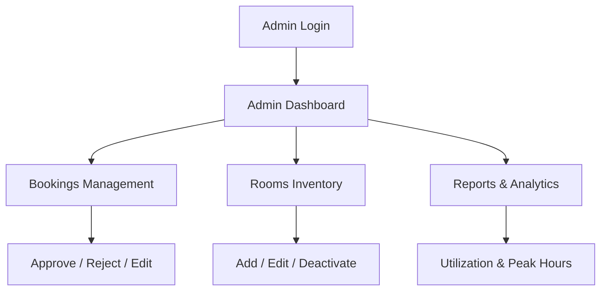
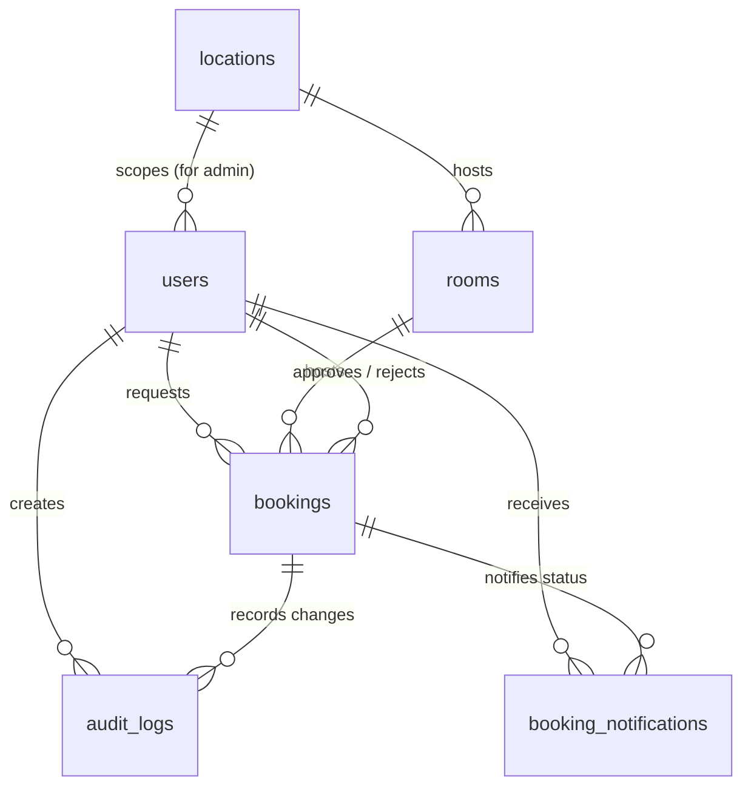

# Administrative System Documentation: Training Room Booking System

This document provides a highly detailed, comprehensive technical and feature-oriented analysis of the **Administrative Control Panel** within the Training Room Booking System 2. 

The application is built on a modern full-stack architecture combining a robust **Laravel 11+ REST API** (using Laravel Sanctum for secure tokenized authentication) and a highly responsive, rich-UI **React SPA** (leveraging TanStack Query, Tailwind CSS, and Lucide React icons).

---

## 1. Architectural Design & Security Systems

The admin system is engineered with an isolated security model, ensuring administrative commands are sandboxed, secure, and performant.

### 1.1 Dual-Session Isolation
Unlike basic monolithic architectures where a user has only one session, this system implements **Session Isolation** between standard booking users and administrators. 
* **Separate Local Storage Keys**: The frontend (via `AuthProvider` and `useAuth` hook) tracks and manages two independent state contexts and sets of credentials:
  * **Standard User Keys**: `USER_TOKEN_KEY` and `USER_DATA_KEY`
  * **Admin Keys**: `ADMIN_TOKEN_KEY` and `ADMIN_DATA_KEY`
* **Simultaneous Sign-in**: An administrator can be simultaneously signed into the normal booking application as a standard employee and logged into the Administrative **"Command Center"** in another tab without session collisions or token overwrites.

### 1.2 Specialized Axios Request Interceptors
The application utilizes a shared Axios client (`apiClient.js`) that automatically handles token routing:
```javascript
const url = config.url || '';
const isAdminRoute = url.startsWith('/admin');

const token = isAdminRoute
    ? localStorage.getItem(ADMIN_TOKEN_KEY)
    : localStorage.getItem(USER_TOKEN_KEY);
```
* **Auto-Routing**: Outbound requests starting with `/api/admin/*` are automatically injected with the Admin Token, while all other requests use the standard User Token.
* **Granular 401 Handling**: If a `401 Unauthorized` response is received, the response interceptor selectively clears **only** the affected session (i.e., logging the admin out of the admin panel, but preserving their normal user booking session in the frontend).

### 1.3 Role Hierarchies (Super Admin vs. Location Admin)
The system supports two tiers of administrative privileges mapped from the `UserRole` Enum:
1. **Super Administrator (`super_admin`)**: Grants full global control across all geographical locations. Super Admins can see all bookings, manage all rooms, and review analytics for the entire organization.
2. **Location Administrator (`location_admin`)**: Scopes administrative access to a specific branch or location (using `location_id`). A Location Admin can only view bookings, manage rooms, and see reports for their designated site, satisfying corporate multi-tenant isolation rules.

---

## 2. Core Administrative Features

The administrative console is divided into four main pillars accessible via the modern blur-glass sidebar layout (`AdminLayout.jsx`).



### 2.1 Admin Login Portal ("Command Center")
* **Premium Interface**: A premium split-screen design (`AdminLogin.jsx`). The left half showcases a dark, high-contrast, glowing brand card with glassmorphic accents ("COMMAND CENTER" subtitle), and the right half displays a minimalist, elegant login form.
* **Authentication Safeguards**: Prevents role leakage. If an admin attempts to sign in via the normal user portal, the backend redirects them to the admin portal. Conversely, standard accounts without the `location_admin` or `super_admin` role are blocked from signing in here, throwing an explicit `"This account does not have admin privileges."` validation error.

### 2.2 Live Command Dashboard
* **At-a-Glance Metrics**: Provides dynamic visual statistic cards for crucial Key Performance Indicators (KPIs):
  * **Pending Approvals**: Counts requests waiting for action.
  * **Today's Bookings**: Monitored approved bookings taking place today.
  * **Active Rooms**: The inventory count of fully functional, operational rooms.
  * **This Month's Booking Volume**: Metrics showing system utilization velocity.
* **Recent Activity Feed**: Lists the latest 10 booking requests with color-coded status badges, requestor names, location tags, and times to provide immediate oversight upon log in.

### 2.3 Comprehensive Booking Management
Located at `Bookings.jsx` on the frontend and `AdminController.php` on the backend, this module handles the lifecycle of bookings.

* **Status Tabs**: Admins can quickly filter requests into **Pending**, **Approved**, **Rejected**, **Cancelled**, or **All**.
* **Detailed Cards**: Each booking card exposes critical parameters including Title, ID, Requesting User, Room & Location Code, full Date-Time Span (adjusted to standard `en-MY` local formatting), Attendee Count, and Requestor Contact Number.

#### 2.3.1 Transaction-Safe Approval Flow
To prevent concurrent race conditions (where two admins might approve conflicting bookings for the same room and time slot), the system implements high-security DB locking within `ApprovalService.php`:
1. **DB Transaction Initialization**: Encapsulates the operations in a single database transaction.
2. **Pessimistic Row Locking**: Fetches the booking record using `Booking::lockForUpdate()->findOrFail($id)` to block concurrent updates on the database level.
3. **Re-checking Status**: Confirms the booking status is still `'pending'` to prevent processing a request already altered by another process.
4. **Availability Double-Check**: Re-validates that no approved conflicting booking exists within the designated time slot (`start_time` to `end_time`) for the room.
5. **Update and Persist**: Sets status to `approved`, stamps the approving `user_id` and the current timestamp, and commits the transaction.

#### 2.3.2 Reject Action with Mandated Reason
* **Inline Reject Form**: Clicking "Reject" displays an inline form requiring the administrator to submit a reason.
* **Audit Enforcement**: The backend validation prohibits empty strings. The rejection reason is permanently appended to the booking row (`rejection_reason` column) and logged for future audits.

#### 2.3.3 Administrative Booking Edits
* **Direct Overrides**: Administrators can edit booking metadata (Title, Description, Attendees, Phone) or reschedule bookings (modifying Time Slot or Room).
* **Automatic Re-checking**: Rescheduling an approved booking immediately invokes `AvailabilityService` to ensure the new slot is available, avoiding conflicts during manual adjustments.

---

### 2.4 Room Inventory Management
Provides full CRUD capabilities for managing training rooms, implemented in `RoomController.php` and `Rooms.jsx`.

* **Room Parameter Controls**: Allows admins to create and modify room metadata:
  * Room Name
  * Location (geographical mapping)
  * Seat Capacity (minimum threshold constraints)
  * Description / Internal notes
  * Amenities tags (represented visually as capsule badges)
* **Safe Soft-Deactivation**: Deleting a room does not execute a hard SQL delete. To preserve historical metrics and past audit trails, the system performs a **soft-deactivation** (`is_active` set to `false`). Inactive rooms are visually greyed out in the grid and excluded from public reservation search forms, but remain archived in reports.

---

### 2.5 Advanced Analytics & Reporting
Designed in `ReportController.php` and rendered in `Reports.jsx` using custom modern Tailwind components.

#### 2.5.1 Room Utilization Analytics
Calculates the operational efficiency of each room over a specified date range based on approved bookings and operating hours:
$$\text{Utilization \%} = \left( \frac{\text{Total Booked Hours}}{\text{Available Operating Hours}} \right) \times 100$$
* **Operating Hours Mapping**: Resolves available hours using application configuration limits (`operating_hours.open` and `operating_hours.close`).
* **Visual Density Gradients**: Progress bars for each room change color automatically depending on utilization intensity to highlight bottlenecks:
  * <span style="color:#ef4444">**High (>70% - Red/Amber Gradient)**</span>: High traffic, warning of booking congestion.
  * <span style="color:#8b5cf6">**Moderate (30%-70% - Blue/Purple Gradient)**</span>: Balanced, healthy room usage.
  * <span style="color:#14b8a6">**Low (<30% - Emerald/Teal Gradient)**</span>: Under-utilized asset.

#### 2.5.2 Peak Booking Hours
Aggregates and exposes peak system load times in hourly increments over selected periods.
* **Overlap Calculation**: Tallies every approved booking overlapping with each operational hour slot (e.g. from 8 AM to 6 PM).
* **Interactive Dynamic Bar Chart**: Displays booking counts via vertically animated flex bars scaled proportionally to the peak hour count.

---

## 3. Supporting Enterprise Framework Services

### 3.1 Audit Log Engine (`AuditService.php`)
Every administrative action (Approval, Rejection, Modification) is recorded in the `audit_logs` table for tracking and compliance:
* **Payload Logs**: Stores the action name (`approved`, `rejected`, `admin_updated`), acting admin ID, and booking reference.
* **State Diffing**: For booking updates, the service diffs the model state and serializes the exact `before` and `after` attributes in a JSON payload.
* **Security Logs**: Captures the IP Address (`request()->ip()`) of the administrator executing the command.

### 3.2 Automated Transactional Notifications (`NotificationService.php`)
Ensures booking requestors are immediately updated when actions are taken on their pending requests:
* **Background Dispatches**: Spawns notification events on status change (`approved` / `rejected`).
* **State Logging**: Writes to a `booking_notifications` ledger storing details on the delivery channel (`email`), current state (`pending`, `sent`, `failed`), retry attempts, and detailed error messages if the mail server encounters issues.

### 3.3 Conflict Resolution & Suggestions (`AvailabilityService.php`)
If an administrator rejects a booking due to scheduling conflicts or has to reschedule one, the system uses a heuristic helper within `AvailabilityService.php`:
* **Nearby Time Suggestions**: Scrapes and suggests alternative slots in the same room (shifting in 30-minute intervals up to $\pm2$ hours).
* **Alternative Room Suggestions**: Scrapes alternative active rooms available at the exact requested time slot across other locations or sizes.

---

## 4. Database Schema Relationships

Below is the database relationship mapping showing how admin entities connect to system objects.


