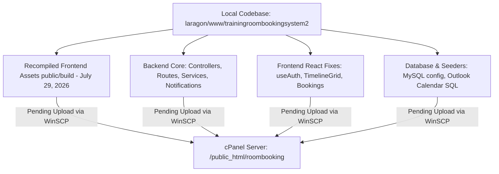

# cPanel Deployment & Upload Audit Report

**Audit Date:** August 5, 2026  
**Project:** Training Room Booking System 2 (`trainingroombookingsystem2`)

---

## 📌 Last Upload Status (WinSCP)

* **Last Upload Timestamp:** `2026-06-18 16:53:33 +08:00` (June 18, 2026, 4:53 PM)
* **WinSCP Session Name:** `mimosaca@ftp.mimos-academy.com`
* **Target Server Host:** `115.187.22.204` (Port 21, FTPS)
* **Local Source Path:** `C:\laragon\www\trainingroombookingsystem2\public`
* **Remote cPanel Target:** `/public_html/roombooking`
* **FTPS Certificate Fingerprint Validated:** `June 3, 2026, 3:23 PM`

---

## 🚀 Summary of Pending Changes (Not Yet Uploaded)

Since the last upload on **June 18, 2026**, a total of **72 git-committed files** (2,335 insertions, 569 deletions), recompiled production build assets, and several new local files have **not** been uploaded to cPanel.

---

## 📋 Detailed Breakdown of Pending Uploads

### 1. 🎨 Production Frontend Build Assets (`public/build`)
> [!IMPORTANT]
> Because the WinSCP session is mapped to `C:\laragon\www\trainingroombookingsystem2\public`, uploading the recompiled assets in `public/build` is mandatory for frontend fixes to take effect live.

* **Rebuild Timestamp:** `2026-07-29 08:55:22 AM`
* **Key Files:**
  * `public/build/manifest.json`
  * `public/build/assets/app-DkJsGsXQ.css`
  * `public/build/assets/createLucideIcon-u3p34FBV.js`
  * `public/build/assets/timeline-grid-*.js` & related component chunks.

---

### 2. ⚡ Backend Core & API Layer (72 Files Changed)

#### **Controllers (`app/Http/Controllers/Api/`)**
* `AdminController.php` — Updated admin dashboard metrics and room management handlers.
* `AdminInvitationController.php` — Refactored admin invitations.
* `AuthController.php` — Enhanced authentication & token management.
* `AvailabilityController.php` — Availability query optimizations.
* `BookingController.php` — Booking status, approval flow, and validation updates.
* `CalendarController.php` — Calendar export endpoint adjustments.
* `ReportController.php` — Reporting metric fixes.
* `RoomController.php` — Room CRUD logic updates.
* `UserManagementController.php` — Refactored user role management.

#### **Routes & Middleware**
* `routes/api.php` — Updated endpoint routes, middleware grouping, and permission security.
* `app/Http/Middleware/EnsureUserIsAdmin.php` & `EnsureUserIsSuperAdmin.php` — Middleware security checks.

#### **Services (`app/Services/`)**
* `BookingService.php` — Core booking logic refactoring.
* `AvailabilityService.php` — Room schedule availability algorithms.
* `CalendarExportService.php` — iCal and calendar export formatter updates.
* `NotificationService.php` & `ApprovalService.php` — Notification dispatch and approval workflow enhancements.

#### **Notifications (`app/Notifications/`)**
* `BookingStatusChangedNotification.php` — Updated notification template and status changes.
* `AdminNewBookingNotification.php`
* `AdminInvitationNotification.php`
* `AdminBookingCancelledNotification.php`
* `ResetPasswordNotification.php`

---

### 3. ⚛️ Frontend React Source (`resources/js/`)
* `resources/js/hooks/useAuth.jsx` — Resolved React hook ordering bugs and state handling.
* `resources/js/components/TimelineGrid.jsx` — Timeline grid rendering fixes.
* `resources/js/components/HeaderSearchModal.jsx` — Search modal UX updates.
* `resources/js/pages/admin/Bookings.jsx` — Admin bookings table UI updates.

---

### 4. 🗄️ Database & Seeders

#### **Configuration**
* `config/database.php` — Default MySQL environment configuration.
* `config/sanctum.php` — Sanctum API token domain setup.

#### **Seeders & SQL Imports**
* `database/seeders/UserSeeder.php` — Updated development seeders to RFC standard domains with security disclaimers.
* **New Untracked Calendar Seeders & Dumps:**
  * `database/seeders/OutlookCalendarImportSeeder.php`
  * `database/seeders/September2026CalendarImportSeeder.php`
  * `database/seeders/outlook_calendar_import.sql`
  * `database/seeders/september_2026_calendar_import.sql`
  * `database/seeders/outlook_calendar_import_clean.sql`
  * `database/seeders/outlook_calendar_import_noprefix.sql`

---

### 5. 📑 Documentation Updates (`docs/`)
* `docs/FINAL_INDUSTRIAL_TRAINING_PRESENTATION_DOCUMENTATION.md`
* `OUTLOOK_IMPORT_GUIDE.md`
* `docs/SETUP_GUIDE.md`
* `docs/IT_Approval_Response.md`
* `CONTRIBUTING.md`

---

## 🛠️ Step-by-Step Deployment Instructions

1. **Upload Frontend Build Assets:**
   * In WinSCP, open session `mimosaca@ftp.mimos-academy.com`.
   * Upload the local directory `public/build/` to `/public_html/roombooking/build/`.

2. **Upload Backend & Application Files (If cPanel hosts full Laravel source):**
   * Upload updated files in `app/`, `routes/`, `config/`, `database/`, `resources/`, and `bootstrap/`.

3. **Run Remote Database Migrations / Seeders (If applicable):**
   * Execute pending migrations/seeders or import `database/seeders/september_2026_calendar_import.sql` via cPanel phpMyAdmin if new room booking calendar data is required.
